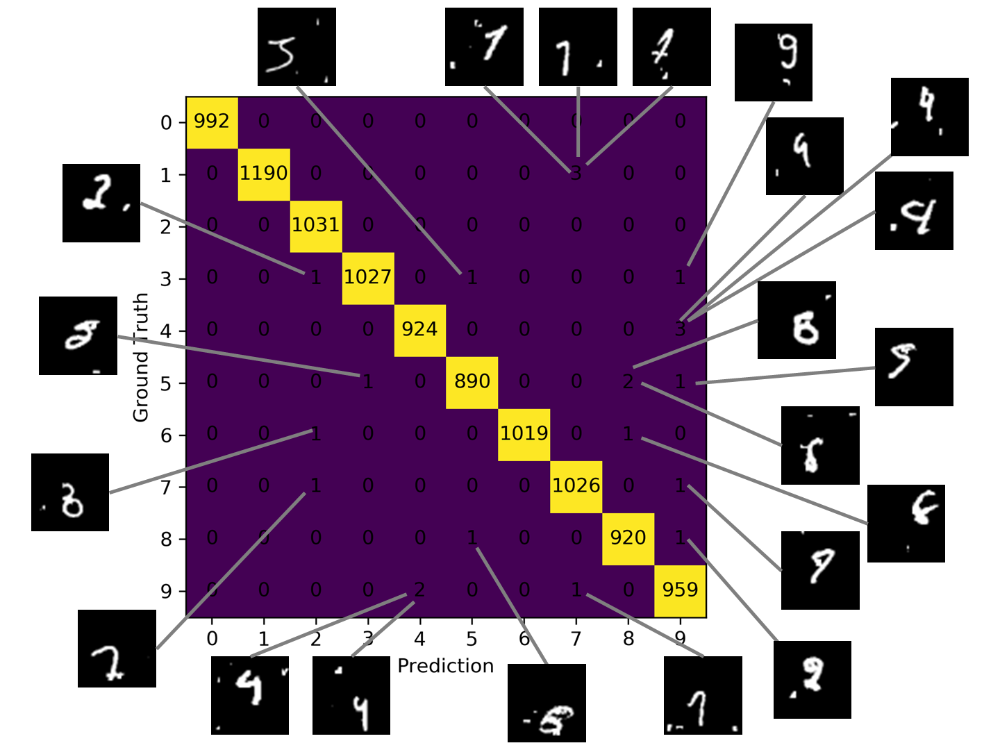

# MNIST-baselines
This repository contains various baseline models for comparison on the *polluted MNIST* dataset

## Requirements
- [NumPy](http://www.numpy.org/)
- [scikit-learn](http://scikit-learn.org/stable/index.html)
- [PyTorch](http://pytorch.org/)

## Usage
### Create a model
1. Prepare `Model_Name.json` in [`config/`](./config)
2. Prepare `Model_Name.py` in [`models/`](./models)
3. Prepare `Trainer_Name.py` in [`trainers/`](./trainers) (optional) 
### Train a model
`python3 main.py --method Model_Name`
### Test a model
`python3 main.py --method Model_Name --test`

## *Polluted MNIST*

<figure class="half">
    
</figure>

## Feature Extraction

A visualization of the first 15 principle components:

<figure class="half">
    
</figure>

| Model | Accuracy / % | Model | Accuracy / % |
| :---- |:------------:| :---- |:------------:|
| Plain DNN | 90.72 | DNN + Dropout | 90.74 |
| DNN + Batch Normalization | 92.39 | DNN + PCA (0.99 variance) | 21.40 |
| DNN + PCA (0.95 variance) | 21.34 | DNN + PCA (0.90 variance) | 20.55 |
| DNN + ICA | 11.93 | DNN + NMF | 11.30 |
| DNN + VAE | **95.24** | 

## Conventional Classification Approaches

| Model | Accuracy / % | Model | Accuracy / % |
| :---- |:------------:| :---- |:------------:|
| Empty Model | 11.04 | Naive Bayes | 19.14 |
| Logistic Regression | 24.37 | Decision Tree (gini) | 51.24 |
| Decision Tree (entropy) | 50.91 | KNN (3 neighbours) | 78.82 |
| KNN (5 neighbours) | 78.46 | KNN (10 neighbours) | 76.40 |
| SGD | 22.30 | SVM (sigmoid kernel) | 10.84 |
| SVM (rbf kernel) | 85.94 | SVM (polynomial kernel) | **87.11** |

The training curves of the above DNN models:

<figure class="half">
    
    
</figure>

## Deep Convolutional Neural Networks
| Model | Accuracy / % | Model | Accuracy / % |
| :---- |:------------:| :---- |:------------:|
| [LeNet-5](http://yann.lecun.com/exdb/publis/pdf/lecun-01a.pdf) | 98.35 | [MobileNetV2](https://arxiv.org/pdf/1801.04381.pdf) | 99.63 |
| [VGG-19](https://arxiv.org/pdf/1409.1556.pdf) | 99.64 | [ShuffleNetG3](https://arxiv.org/pdf/1707.01083.pdf) | 99.65 |
| [ResNet-101](https://arxiv.org/pdf/1512.03385.pdf) | 99.71 | [GoogLeNet](https://www.cs.unc.edu/~wliu/papers/GoogLeNet.pdf) | **99.82** |
| [PreAct ResNet-152](https://arxiv.org/pdf/1603.05027.pdf) | 99.68 | [PNASNet](https://arxiv.org/pdf/1712.00559.pdf) | 99.75 |
| [DenseNet-161](https://arxiv.org/pdf/1608.06993.pdf) | 99.75 | [ResNeXt-29-8x64d](https://arxiv.org/pdf/1611.05431.pdf) | 99.71 |
| [DPN-92](https://arxiv.org/pdf/1707.01629.pdf) | 99.76 | [SENet-18](https://arxiv.org/pdf/1709.01507.pdf) | 99.69 |
| [MobileNet](https://arxiv.org/pdf/1704.04861.pdf) | 99.44 | [CapsNet](https://arxiv.org/pdf/1710.09829.pdf) | 98.84 |

## Faults Analysis
<figure class="half">
    
</figure>

## Team Members
- [Xiangyu Chen](https://github.com/cxy1997)
- [Zelin Ye](https://github.com/shinshiner)
- [Yiheng Zhang](https://github.com/StanwieCB)
